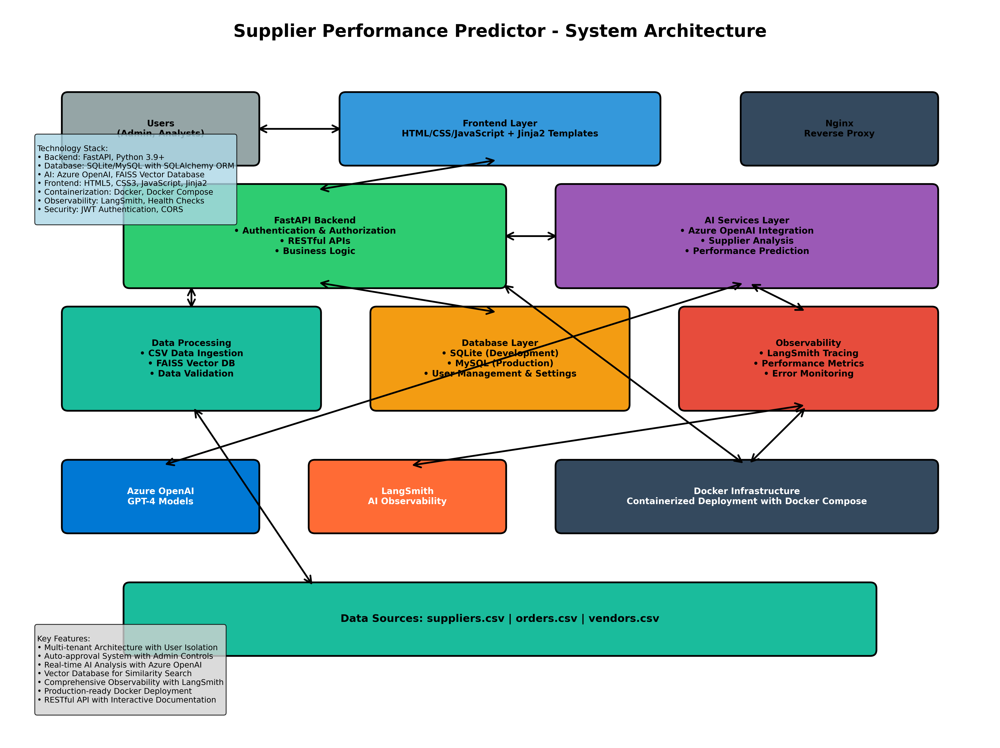

# 🚀 Supplier Performance Predictor AI System

[]()
[]()
[]()
[]()
[]()

An enterprise-grade AI-powered supply chain intelligence system that predicts supplier reliability, flags high-risk orders, and recommends alternate vendors using advanced machine learning and natural language processing with comprehensive observability.

## 🎯 Problem Statement

Supply chain disruptions and unreliable suppliers can cause significant business losses, with costs reaching millions for enterprises. Traditional supplier evaluation methods are reactive and lack predictive capabilities. This system provides:

- **Proactive Risk Assessment**: Predict supplier reliability before issues occur
- **Real-time Order Flagging**: Identify high-risk orders automatically  
- **Smart Vendor Recommendations**: AI-powered alternative supplier suggestions
- **Data-Driven Insights**: Comprehensive analytics dashboard for decision making
- **Complete Observability**: Monitor AI performance, costs, and reliability

## 🏗️ System Architecture



> **📋 Detailed Architecture**: See [ARCHITECTURE.md](ARCHITECTURE.md) for comprehensive system design documentation.

### High-Level Overview

The Supplier Performance Predictor follows a modern microservices architecture with the following key layers:

- **🎨 Frontend Layer**: Interactive web interface built with HTML5/CSS3/JavaScript
- **🚀 API Layer**: FastAPI backend with RESTful endpoints and auto-documentation  
- **🤖 AI Services**: Azure OpenAI integration for intelligent predictions and analysis
- **💾 Data Layer**: Multi-tenant database with SQLite/MySQL support
- **📊 Observability**: LangSmith integration for AI monitoring and cost tracking
- **🐳 Infrastructure**: Docker containerization with production-ready deployment

## ✨ Key Features

### 🤖 AI-Powered Analysis
- **GPT-4 Integration**: Advanced reasoning for supplier reliability assessment
- **Vector Embeddings**: FAISS-powered similarity search for vendor recommendations
- **Batch Processing**: Handle multiple suppliers efficiently
- **LangSmith Monitoring**: Complete AI observability with traces, analytics, and cost monitoring

### 📊 Real-Time Dashboard
- **Interactive Charts**: Performance trends and risk distribution
- **KPI Monitoring**: Live supplier metrics and alerts
- **User-Specific Data**: Secure multi-tenant data isolation
- **Responsive Design**: Mobile-friendly interface

### 🔒 Enterprise Security
- **Multi-Tenant Architecture**: Complete data isolation between users
- **Session Authentication**: Secure access control with approval workflows
- **Admin Controls**: User management with auto-approval settings
- **Audit Trails**: Complete activity logging and monitoring

### 🔍 Advanced Observability
- **LangSmith Integration**: Real-time AI monitoring and analytics
- **Performance Tracking**: Response times, success rates, and costs
- **Error Monitoring**: Comprehensive error tracking and alerting
- **Usage Analytics**: Token consumption and API usage insights

## 🚀 Quick Start

### Prerequisites
- Python 3.8 or higher
- Azure OpenAI API key
- LangSmith API key (optional but recommended)
- Git

### Installation

1. **Clone the repository**
```bash
git clone <repository-url>
cd supplier-performance-predictor
```

2. **Install dependencies**
```bash
pip install -r requirements.txt
```

3. **Set up environment variables**
```bash
# Create .env file
cp .env.example .env

# Configure your environment
AZURE_OPENAI_API_KEY=your_api_key_here
AZURE_OPENAI_ENDPOINT=your_endpoint_here
AZURE_OPENAI_API_VERSION=2024-12-01-preview
AZURE_OPENAI_DEPLOYMENT_NAME=gpt-4.1

# LangSmith Observability (Optional)
LANGSMITH_API_KEY=your_langsmith_key
LANGSMITH_PROJECT=supplier-predictor
LANGSMITH_TRACING=true
```

4. **Initialize the database**
```bash
python3 -c "from backend.database import create_tables, create_default_admin; create_tables(); create_default_admin()"
```

### Running the Application

**Start the backend server:**
```bash
python3 -m uvicorn backend.main:app --reload --host 0.0.0.0 --port 8001
```

**Access the application:**
- Web Interface: http://localhost:8001
- API Documentation: http://localhost:8001/docs
- Admin Login: admin / admin123

## 📖 Usage Guide

### 1. User Registration & Management
- Users can register through the web interface
- Admin approval required (configurable auto-approval)
- Complete user profile management

### 2. Supplier Data Upload
- Upload CSV files with supplier information
- Automatic data validation and processing
- Batch prediction capabilities

### 3. AI Predictions
- **Single Prediction**: Analyze individual suppliers
- **Batch Prediction**: Process multiple suppliers at once
- **Order Flagging**: Identify high-risk orders
- **Vendor Recommendations**: Find alternative suppliers

### 4. Dashboard Analytics
- Real-time performance metrics
- Trend analysis and forecasting
- Risk distribution visualizations
- Export capabilities

### 5. Admin Controls
- User approval management
- System settings configuration
- Activity monitoring
- Auto-approval toggle

## 🔧 API Endpoints

### Authentication
- `POST /login` - User authentication
- `POST /register` - User registration
- `GET /logout` - User logout

### Predictions
- `POST /api/predict_supplier_reliability` - Batch prediction
- `POST /api/single_predict` - Single supplier prediction
- `GET /api/dashboard/stats` - Dashboard statistics

### Admin
- `GET /api/admin/stats` - Admin statistics
- `GET /api/admin/pending-users` - Pending approvals
- `POST /api/admin/approve-user/{user_id}` - Approve user
- `GET /api/admin/system-settings` - System settings
- `POST /api/admin/system-settings` - Update settings

## 📊 Data Format

### Supplier CSV Format
```csv
supplier_id,supplier_name,location,industry,contact_person,email,phone,on_time_delivery_rate,quality_score,financial_stability,communication_rating,previous_issues,contract_terms,payment_terms
SUP001,TechCorp Industries,USA,Technology,John Smith,john@techcorp.com,+1-555-0123,95.5,4.8,A+,Excellent,None,Standard,Net 30
```

### Required Fields
- `supplier_id`: Unique identifier
- `supplier_name`: Company name
- `location`: Geographic location
- `industry`: Business sector
- `contact_person`: Primary contact
- `email`: Contact email
- `phone`: Contact phone
- `on_time_delivery_rate`: Percentage (0-100)
- `quality_score`: Rating (1-5)
- `financial_stability`: Grade (A+, A, B, C, D)
- `communication_rating`: Text rating
- `previous_issues`: Issue history
- `contract_terms`: Contract details
- `payment_terms`: Payment conditions

## 🔍 Monitoring & Observability

### LangSmith Integration
The system includes comprehensive AI observability through LangSmith:

- **Real-time Traces**: Monitor every AI interaction
- **Performance Analytics**: Track response times and success rates
- **Cost Monitoring**: Monitor token usage and API costs
- **Error Tracking**: Automatic error capture and alerting

### Accessing LangSmith Dashboard
1. Visit https://smith.langchain.com
2. Login with your LangChain account
3. Select your configured project
4. Monitor traces in real-time

### Key Metrics Tracked
- Individual prediction performance
- Batch processing analytics
- Dashboard load times
- Error rates and types
- Token consumption
- API response times

## 🛡️ Security Features

### Multi-Tenant Architecture
- Complete data isolation between users
- User-specific prediction history
- Secure session management
- Admin-level access controls

### Authentication & Authorization
- Session-based authentication
- Role-based access control (User/Admin)
- Approval workflow for new users
- Configurable auto-approval settings

### Data Protection
- Input validation and sanitization
- SQL injection prevention
- Secure password hashing
- CSRF protection

## 🔧 Configuration

### System Settings (Admin Panel)
- **Auto Approval**: Automatically approve new user registrations
- **Email Notifications**: Enable/disable email alerts
- **Max Predictions**: Set per-user prediction limits
- **Maintenance Mode**: System-wide maintenance toggle

### Environment Variables
```bash
# Azure OpenAI Configuration
AZURE_OPENAI_API_KEY=your_api_key
AZURE_OPENAI_ENDPOINT=your_endpoint
AZURE_OPENAI_API_VERSION=2024-12-01-preview
AZURE_OPENAI_DEPLOYMENT_NAME=gpt-4.1

# LangSmith Observability
LANGSMITH_API_KEY=your_langsmith_key
LANGSMITH_PROJECT=your_project_name
LANGSMITH_TRACING=true
LANGCHAIN_TRACING_V2=true
LANGSMITH_ENDPOINT=https://api.smith.langchain.com

# Database Configuration
DATABASE_URL=sqlite:///./supplier_predictor.db

# Application Settings
APP_SECRET_KEY=your_secret_key
DEBUG=False
```

## 🐛 Troubleshooting

### Common Issues

**1. Azure OpenAI Connection Issues**
- Verify API key and endpoint
- Check deployment name
- Ensure API version compatibility

**2. LangSmith Not Tracking**
- Verify API key is set
- Check project name configuration
- Ensure tracing is enabled

**3. Database Issues**
- Ensure proper file permissions
- Check database initialization
- Verify SQLite installation

**4. Authentication Problems**
- Clear browser cache/cookies
- Check session configuration
- Verify admin account creation

### Debug Mode
```bash
# Enable debug logging
export DEBUG=True
python3 -m uvicorn backend.main:app --reload --log-level debug
```

## 📈 Performance Optimization

### Batch Processing
- Process multiple suppliers in single requests
- Optimized database queries
- Async processing for better performance

### Caching Strategy
- Vector embeddings caching
- Database query optimization
- Session management efficiency

### Monitoring
- Real-time performance metrics
- LangSmith observability integration
- System resource monitoring

## 🤝 Contributing

1. Fork the repository
2. Create a feature branch
3. Make your changes
4. Add comprehensive tests
5. Update documentation
6. Submit a pull request

## 📄 License

This project is licensed under the MIT License - see the LICENSE file for details.

## 🆘 Support

For support and questions:
- Create an issue in the repository
- Check the documentation
- Review the troubleshooting guide

## 🔮 Future Enhancements

- **Machine Learning Models**: Custom ML models for prediction
- **Advanced Analytics**: Predictive forecasting and trend analysis
- **Integration APIs**: Connect with ERP and supply chain systems
- **Mobile App**: Native mobile application
- **Advanced Security**: OAuth2 and SSO integration
- **Microservices**: Containerized deployment with Kubernetes

---

**Built with ❤️ using FastAPI, Azure OpenAI, and LangSmith**

### 📊 Real-Time Dashboard
- **Interactive Charts**: Performance trends and risk distribution
- **KPI Monitoring**: Live supplier metrics and alerts
- **Export Capabilities**: PDF reports and data exports
- **Responsive Design**: Mobile-friendly interface

### 🔒 Enterprise-Ready
- **Session Authentication**: Secure access control
- **RESTful APIs**: Standard HTTP endpoints for integration
- **Async Processing**: High-performance request handling
- **Error Handling**: Comprehensive logging and error management

## 🚀 Quick Start

### Prerequisites
- Python 3.8 or higher
- Azure OpenAI API key
- Git

### Installation

1. **Clone the repository**
```bash
git clone <repository-url>
cd supplier-performance-predictor
```

2. **Install dependencies**
```bash
pip install -r requirements.txt
```

3. **Set up environment variables**
```bash
# Create .env file
cp .env.example .env

# Add your Azure OpenAI credentials
AZURE_OPENAI_API_KEY=your_api_key_here
AZURE_OPENAI_ENDPOINT=your_endpoint_here
AZURE_OPENAI_API_VERSION=2024-02-15-preview
AZURE_OPENAI_DEPLOYMENT_NAME=your_deployment_name
```

4. **Initialize the database**
```bash
python -c "from backend.database import init_db; init_db()"
```

### Running the Application

**Option 1: Full Stack (Recommended)**
```bash
# Start the backend server
python -m uvicorn backend.main:app --reload --host 0.0.0.0 --port 8001

# In a new terminal, start the frontend
cd frontend
python app.py
```

**Option 2: API Only**
```bash
python -m uvicorn backend.main:app --reload --port 8001
```

### Access the Application
- **Web Dashboard**: http://localhost:8501
- **API Documentation**: http://localhost:8001/docs
- **Login Credentials**: `admin` / `admin123`

## 📚 API Endpoints

### Authentication
```http
POST /login
Content-Type: application/x-www-form-urlencoded

username=admin&password=admin123
```

### Core Functionality
```http
# Predict supplier reliability
POST /api/predict_supplier_reliability
Content-Type: application/json

{
  "suppliers": [
    {
      "supplier_id": "SUP001",
      "supplier_name": "TechCorp Solutions",
      "reliability_score": 0.85,
      "past_delivery_rate": 0.92,
      "on_time_percentage": 88,
      "category": "Electronics",
      "region": "North America",
      "risk_level": "Medium"
    }
  ]
}
```

```http
# Get dashboard statistics
GET /api/dashboard/stats
Cookie: session_id=<session_id>
```

```http
# Flag high-risk orders
POST /api/flag_orders
Content-Type: application/json

{
  "orders": [
    {
      "order_id": "ORD001",
      "supplier_id": "SUP001",
      "order_amount": 50000,
      "delivery_date": "2024-03-15",
      "priority": "High"
    }
  ]
}
```

```http
# Get vendor recommendations
POST /api/recommend_vendors
Content-Type: application/json

{
  "requirements": {
    "category": "Electronics",
    "region": "North America",
    "min_reliability": 0.8
  }
}
```

## 📁 Project Structure

```
supplier-performance-predictor/
├── backend/
│   ├── main.py                 # FastAPI application entry
│   ├── auth.py                 # Authentication logic
│   ├── database.py             # Database models and setup
│   ├── routes/
│   │   ├── predict.py          # Prediction endpoints
│   │   ├── flag.py             # Order flagging endpoints
│   │   └── recommend.py        # Recommendation endpoints
│   └── services/
│       ├── azure_ai_service.py # Azure OpenAI integration
│       ├── azure_openai_client.py # OpenAI client wrapper
│       ├── faiss_db.py         # Vector database operations
│       ├── supplier.py         # Supplier business logic
│       ├── order.py            # Order processing logic
│       └── vendor.py           # Vendor recommendation logic
├── frontend/
│   ├── app.py                  # Streamlit dashboard
│   └── templates/
│       ├── dashboard.html      # Main dashboard template
│       └── base.html           # Base template
├── data/
│   ├── suppliers.csv           # Sample supplier data
│   ├── orders.csv              # Sample order data
│   └── vendors.csv             # Sample vendor data
├── observability/
│   └── langsmith_hook.py       # LangSmith integration
├── requirements.txt            # Python dependencies
└── README.md                   # This file
```

## 🛠️ Technology Stack

### Backend
- **FastAPI**: Modern, fast web framework for building APIs
- **SQLAlchemy**: SQL toolkit and ORM
- **SQLite**: Lightweight database for analytics storage
- **Pandas**: Data manipulation and analysis
- **Python-dotenv**: Environment variable management

### AI & ML
- **Azure OpenAI**: GPT-4 for advanced reasoning
- **Semantic Kernel**: AI orchestration framework
- **FAISS**: Vector similarity search
- **LangSmith**: AI observability and monitoring

### Frontend
- **Streamlit**: Interactive web dashboard
- **Chart.js**: Dynamic data visualizations
- **Bootstrap**: Responsive UI framework
- **HTML/CSS/JavaScript**: Custom dashboard components

## 📊 Sample Data Format

### Suppliers CSV
```csv
supplier_id,supplier_name,reliability_score,past_delivery_rate,on_time_percentage,category,region,risk_level
SUP001,TechCorp Solutions,0.85,0.92,88,Electronics,North America,Medium
SUP002,Global Manufacturing,0.78,0.89,82,Manufacturing,Europe,High
```

### Orders CSV
```csv
order_id,supplier_id,order_amount,delivery_date,priority,status
ORD001,SUP001,50000,2024-03-15,High,Pending
ORD002,SUP002,25000,2024-03-20,Medium,Processing
```

### Vendors CSV
```csv
vendor_id,vendor_name,category,region,rating,contact_email
VEN001,Premium Electronics,Electronics,North America,4.8,contact@premium.com
VEN002,Euro Manufacturing,Manufacturing,Europe,4.5,info@euroman.com
```

## 🔧 Configuration

### Environment Variables
```bash
# Azure OpenAI Configuration
AZURE_OPENAI_API_KEY=your_api_key
AZURE_OPENAI_ENDPOINT=https://your-resource.openai.azure.com/
AZURE_OPENAI_API_VERSION=2024-02-15-preview
AZURE_OPENAI_DEPLOYMENT_NAME=gpt-4

# LangSmith Configuration (Optional)
LANGCHAIN_TRACING_V2=true
LANGCHAIN_ENDPOINT=https://api.smith.langchain.com
LANGCHAIN_API_KEY=your_langsmith_key
LANGCHAIN_PROJECT=supplier-predictor

# Application Configuration
DEBUG=true
LOG_LEVEL=INFO
```

## 🧪 Testing

### Run Tests
```bash
# Test Azure OpenAI connection
python test_azure_openai.py

# Test API endpoints
python test_endpoint.py

# Test data upload functionality
python test_upload.py
```

### Manual Testing
```bash
# Test prediction endpoint
curl -X POST http://localhost:8001/api/predict_supplier_reliability \
  -H "Content-Type: application/json" \
  -d '{"suppliers": [{"supplier_id": "TEST001", "supplier_name": "Test Corp", "reliability_score": 0.9}]}'

# Test dashboard stats
curl -b "session_id=temp123" http://localhost:8001/api/dashboard/stats
```

## 📈 Performance Metrics

The system tracks several key performance indicators:

- **Prediction Accuracy**: AI model reliability assessment accuracy
- **Response Time**: API endpoint performance metrics
- **Data Processing Speed**: CSV upload and processing benchmarks
- **User Engagement**: Dashboard usage analytics

## 🔒 Security Features

- **User-Specific Data Isolation**: Each user only sees their own predictions and dashboard data
- **Session-based Authentication**: Secure user access control with server-side session management
- **Input Validation**: Comprehensive data sanitization and validation
- **Error Handling**: Secure error messages without sensitive data exposure
- **Rate Limiting**: API endpoint protection (configurable)
- **Data Privacy**: Complete isolation between different users' supplier data

## 🚀 Deployment

### Local Development
```bash
python -m uvicorn backend.main:app --reload --host 0.0.0.0 --port 8001
```

### Production (Docker)

**Single Container Deployment:**
```bash
# Build the Docker image
docker build -t supplier-predictor:latest .

# Run the container (development)
docker run -d --name supplier-predictor -p 8002:8001 supplier-predictor:latest

# Run with environment variables (production)
docker run -d \
  --name supplier-predictor \
  -p 8002:8001 \
  -e AZURE_OPENAI_ENDPOINT="your-endpoint" \
  -e AZURE_OPENAI_API_KEY="your-api-key" \
  -e LANGCHAIN_API_KEY="your-langsmith-key" \
  supplier-predictor:latest

# Access the application
# - Health Check: http://localhost:8002/health
# - API Documentation: http://localhost:8002/docs
# - Frontend: http://localhost:8002
```

**Full Stack with Docker Compose:**
```bash
# Build and start all services (app + database + nginx)
docker-compose up -d

# Access via nginx reverse proxy
# - Frontend: http://localhost
# - API Documentation: http://localhost/docs
# - Admin Panel: http://localhost/admin
```

### Cloud Deployment
- **Azure App Service**: Recommended for production
- **Azure Container Instances**: For containerized deployment
- **Azure OpenAI**: Already integrated for AI services

## 🤝 Contributing

1. Fork the repository
2. Create a feature branch (`git checkout -b feature/amazing-feature`)
3. Commit your changes (`git commit -m 'Add amazing feature'`)
4. Push to the branch (`git push origin feature/amazing-feature`)
5. Open a Pull Request

## 📝 License

This project is licensed under the MIT License - see the [LICENSE](LICENSE) file for details.

## 🆘 Troubleshooting

### Common Issues

**Azure OpenAI Connection Errors**
```bash
# Verify your credentials
python test_azure_openai.py
```

**Database Issues**
```bash
# Reinitialize database
python -c "from backend.database import init_db; init_db()"
```

**Port Already in Use**
```bash
# Kill existing processes
lsof -ti:8001 | xargs kill -9
```

### Getting Help

- **Documentation**: Check the `/docs` endpoint when running the server
- **Logs**: Check console output for detailed error messages
- **Issues**: Open an issue on the repository for bugs or feature requests

## 🎯 Roadmap

### Phase 1 (Current)
- ✅ Core AI prediction functionality
- ✅ Web dashboard with real-time data
- ✅ Azure OpenAI integration
- ✅ Vector-based recommendations

### Phase 2 (Next)
- 🔄 Advanced analytics and reporting
- 🔄 Real-time data streaming
- 🔄 Mobile-responsive improvements
- 🔄 Enhanced security features

### Phase 3 (Future)
- 📋 Multi-tenant architecture
- 📋 Advanced ML model training
- 📋 Integration with ERP systems
- 📋 Automated supplier onboarding

---

**Built with ❤️ for supply chain optimization**

For questions or support, please contact the development team or open an issue in the repository.
